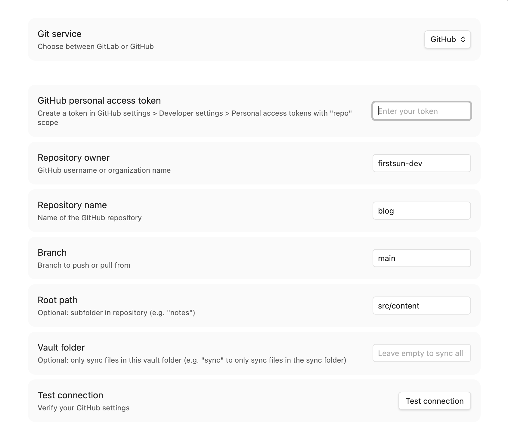
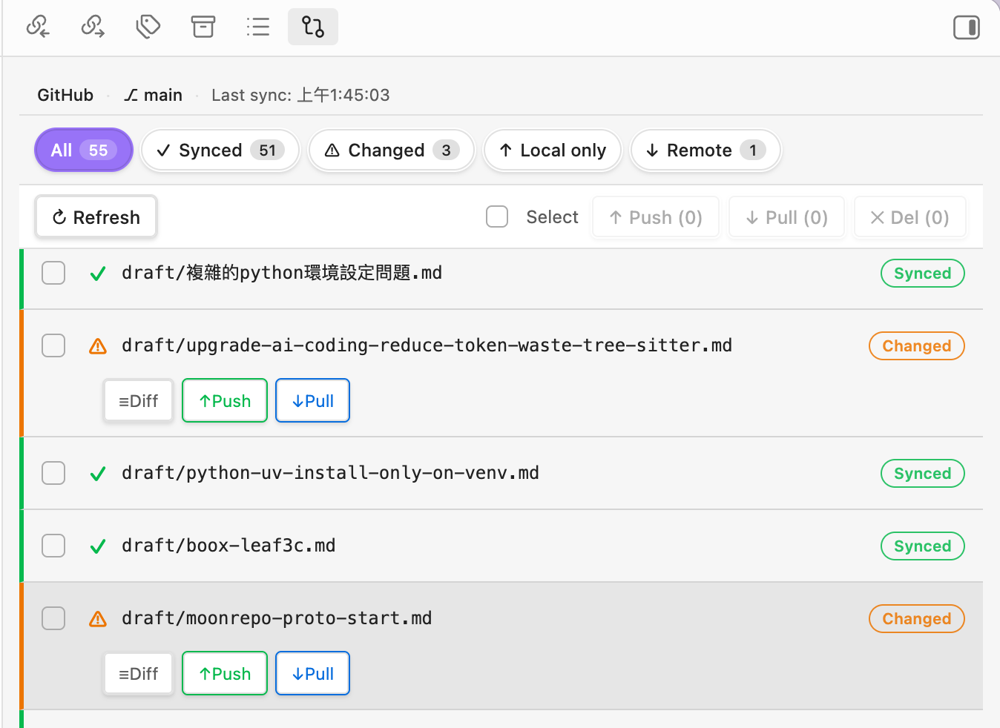
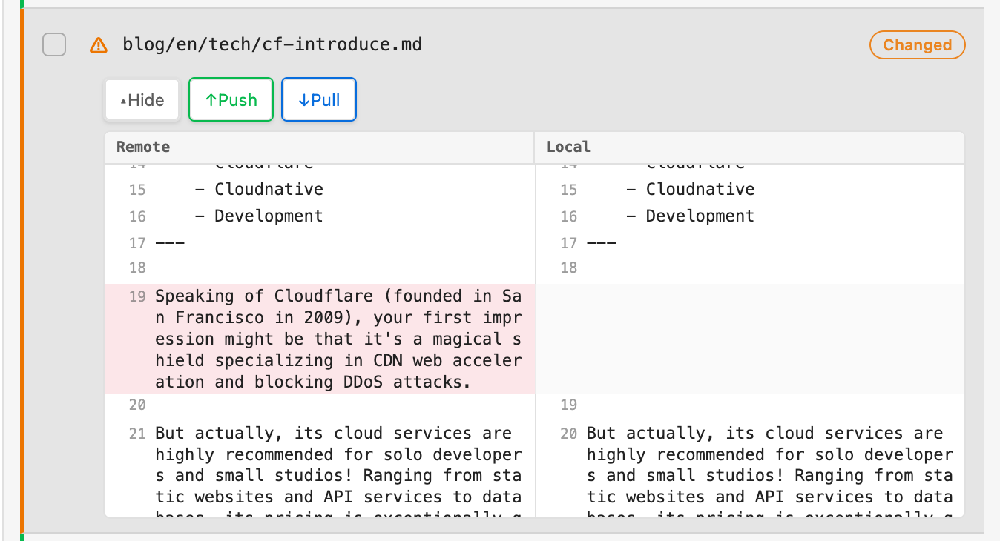

# Git File Sync 使用說明書

<video src="https://blog-assets.firstsun.org/video/obsidian-plugins/git-file-sync-zh.webm" width="100%" controls autoplay loop muted playsinline></video>

本指南將引導您如何使用 Git File Sync 插件，在行動裝置與桌面電腦之間，透過 GitLab 或 GitHub 輕鬆同步您的筆記。

---

## 1. 初始設定

在開始同步之前，請確保您已完成以下設定：

*在設定面板選擇您的 Git 服務並填入對應的憑證與路徑。*

1. **選擇服務**：在 `設定` > `Git File Sync` 中選擇 GitLab 或 GitHub。
2. **填寫憑證**：
   - **GitHub**：需要 個人存取權杖 (PAT)、帳號名稱、儲存庫名稱。
   - **GitLab**：需要 個人存取權杖 (PAT)、專案 ID、伺服器網址 (預設為 gitlab.com)。
3. **儲存庫路徑**：如果您想將筆記存放在儲存庫的特定資料夾（例如 `notes/`），請在 `Root Path` 中設定。

---

## 2. 核心操作流程

### 💡 檢查同步狀態
每次開始工作或切換裝置時，建議先檢查狀態：
1. 點擊側邊欄的 **清單圖示** 或使用指令面板 (`Ctrl/Cmd + P`) 輸入 `Open sync status view`。
2. 點擊 **Refresh status**。
3. 您會看到檔案清單，標示為：
   - **Synced**：已同步（與雲端一致）。
   - **Modified**：本機已修改（需要 Push）。
   - **Remote only**：雲端有新檔案（需要 Pull）。

*同步狀態面板讓您可以一目了然地確認哪些檔案已經修改，並進行上傳或下載。*

---

### ⬆️ 如何上傳（Push）
當您寫完筆記，想備份到雲端時：
- **單一檔案**：
  - 點擊左側功能列的 **雲端上傳圖示**。
  - 或者在檔案列表點擊右鍵，選擇 `Push to GitLab/GitHub`。
- **批量上傳**：
  - 在同步面板勾選多個檔案，點擊下方的 **Push selected**。

---

### ⬇️ 如何下載（Pull）
當您在另一台裝置更新了筆記，想同步回目前裝置時：
1. 打開同步面板，點擊 **Refresh status**。
2. 找到顯示為 **Remote only** 或 **Modified** (雲端版本較新) 的檔案。
3. 勾選後點擊 **Pull selected**。
4. **注意**：Pull 會覆蓋掉您本機的內容。如果有衝突，會自動開啟衝突解決視窗。

---

## 3. 衝突處理 (Conflict Resolution)

如果同一個檔案在本機和雲端都被修改過，同步時會跳出衝突視窗：
1. 左側為 **本機版本**，右側為 **雲端版本**。
2. 您可以查看差異處。
3. 選擇 **Keep Local**（保留本機）或 **Keep Remote**（採用雲端版本）。
4. 選擇後系統會自動更新檔案。

*內建的差異比對工具 (Diff Viewer) 可讓您在同步前並排比對本機與雲端的修改差異。*

---

## 4. 行動裝置使用技巧

- **開啟面板**：從螢幕左側向右滑動，展開功能列即可看到同步圖示。
- **工作前先 Pull**：建議每次開始寫筆記前，先點一下 Refresh 確保讀取到最新版本。
- **完成後即 Push**：寫完後隨手 Push，確保您的變更已儲存至雲端。

---

## 🔒 隱私與安全

- 您的存取權杖 (Token) 僅會儲存在您本機的 Obsidian 資料夾內。
- 本插件不會收集任何個人數據或使用紀錄。
